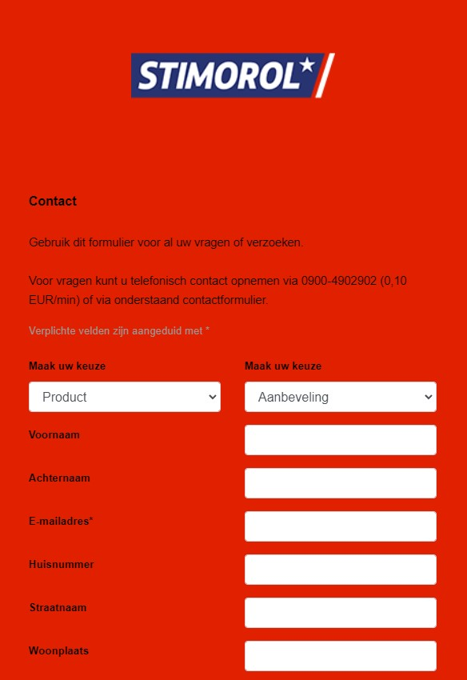

# Procesverslag
Markdown is een simpele manier om HTML te schrijven.  
Markdown cheat cheet: [Hulp bij het schrijven van Markdown](https://github.com/adam-p/markdown-here/wiki/Markdown-Cheatsheet).

Nb. De standaardstructuur en de spartaanse opmaak van de README.md zijn helemaal prima. Het gaat om de inhoud van je procesverslag. Besteedt de tijd voor pracht en praal aan je website.

Nb. Door *open* toe te voegen aan een *details* element kun je deze standaard open zetten. Fijn om dat steeds voor de relevante stuk(ken) te doen.

## Jij

  
uitwerken voor kick-off werkgroep

  ### Auteur:
  Melvin Rooth

  #### Je startniveau:
  Blauw

  #### Je focus:
  Responsive
 

## Je website

  
uitwerken voor kick-off werkgroep

  ### Je opdracht:
  https://www.stimorol.nl/

  #### Screenshot(s) van de eerste pagina (small screen): 
  hier de naam van de pagina  
  
  
  
  
  

  #### Screenshot(s) van de tweede pagina (small screen):
  hier de naam van de pagina  
  
  
  

## Toegankelijkheidstest 1/2 (week 1)

  
uitwerken na test in 1e werkgroep

  ### Bevindingen
  Lijst met je bevindingen die in de test naar voren kwamen:

  #### Screenreader
  Hier korte omschrijving (met indien nodig afbeeldingen)
  Bij de homepagina heb je links, afbeeldingen en radio sectie. Wat doet die precies?
  Hier een omschrijving van hoe het opgelost kan worden (met indien nodig afbeeldingen)
  Betere betekenis geven aan de knoppen in de nav en een betere betekenis/omschrijving
  De screenreader gaat naar een onzichtbare search en het hamburger menu ligt buiten het beeld.

  Daarnaast omschrijven de afbeeldingen niet waar het over gaat.
  Er is geen heading voor featured items, Geen logische en goede volgdorde van voiceovers.
  De CTA is niet duidelijkd als het wordt voorgelezen door een screenreader. Volgende en vorige knop pakt hij niet. Bij de social knoppen is geen heading. Bij de footer wordt niet laten weten dat je in een footer zit, e-mail.
  De volgorde van het formulier klopt niet.

  Bij de formulierpagina:
  Leest niet volledige breadcrumbs, skipt de heading. Slaat kleuren over. Informatie zonder titel. Bij de producten is geen heading. Deelknop staat in een aparte lijst. Voettekst en navigatie volgorde klopt niet helemaal. De headings kloppen daarnaast niet in het algemeen.

  #### Muis en Toetsenbord 
  Hier korte omschrijving (met indien nodig afbeeldingen)

  Hier een omschrijving van hoe het opgelost kan worden (met indien nodig afbeeldingen)

  #### Motoriek (shocks, elastiekjes)
   Hier korte omschrijving (met indien nodig afbeeldingen)
  Bij het bedienen van de site kan het over het algemeen wel als je wilt shoppen. Er is geen gebruik gemaakt van sliders oid die door mensen met een motorische beperking niet gebruikt kunnen worden.
  Hier een omschrijving van hoe het opgelost kan worden (met indien nodig afbeeldingen)
  N.v.t.

  #### Visueel (brillen, contrast, kleurenblind, dark/light). 
   Hier korte omschrijving (met indien nodig afbeeldingen)
  Bij de formulierenpagina is de tekst slecht leesbaar. Vooral grijs op oranje. tekst onderaan is niet goed te lezen met de brillen op en add te cart is lastig te zien.
  Hier een omschrijving van hoe het opgelost kan worden (met indien nodig afbeeldingen)
  Om dit te verhelpen is een tooltip goed van toepassing icm een screenreader.

## Breakdownschets (week 1)

  
uitwerken na afloop 2e werkgroep

   ### de hele pagina: 

  ### dynamisch deel (bijv menu): 

## Voortgang 1 (week 2)

  
uitwerken voor 1e voortgang

  ### Stand van zaken
  hier dit ging goed & dit was lastig (neem ook screenshots op van delen van je website en code)
  HTML was niet helemaal op orde. CSS ging ook niet zo soepel. Mede ook niet zo veel tijd erin gestoken. 
  
  

  ### Agenda voor meeting
  samen met je groepje opstellen

  | Melvin      | Reduane          | Deveney    | Diem        |
  | ---            | ---                | ---          | ---              |
  | HTML. Is dit correct?  | en dit             | en ik dit    | en dan ik dat    |
  | en dat ook nog | dit als er tijd is | nog een punt | dit wil ik zeker |
  | ...            | ...                | ...          | ...              |

  ### Verslag van meeting
  hier na afloop snel de uitkomsten van de meeting vastleggen

  - Meer tijd erin stoppen. Meer coderen.
  - 
  - 
  - 

## Voortgang 2 (week 3)

  
uitwerken voor 2e voortgang

  ### Stand van zaken
  hier dit ging goed & dit was lastig (neem ook screenshots op van delen van je website en code)
  Nog steeds niet helemaal zoals ik wilde. Niet goed op weg en ik had een site gekozen die best moeilijk is. Ik liep continu vast bij het maken van de footer. Verder kwam ik niet. Heel erg frustrerend.

  ### Agenda voor meeting
  samen met je groepje opstellen

  | Melvin      | Reduane          | Deveney    | Diem        |
  | ---            | ---                | ---          | ---              |
  | dit bespreken  | en dit             | en ik dit    | en dan ik dat    |
  | en dat ook nog | dit als er tijd is | nog een punt | dit wil ik zeker |
  | ...            | ...                | ...          | ...              |

  ### Verslag van meeting
  hier na afloop snel de uitkomsten van de meeting vastleggen

  - punt 1
  - punt 2
  - nog een punt
- ...

## Toegankelijkheidstest 2/2 (week 4)

  
uitwerken na test in 8e werkgroep

  ### Bevindingen
  Lijst met je bevindingen die in de test naar voren kwamen (geef ook aan wat er verbeterd is):

  #### Screenreader
  Hier korte omschrijving (met indien nodig afbeeldingen)

  Hier een omschrijving van hoe het opgelost kan worden (met indien nodig afbeeldingen)

  #### Muis en Toetsenbord 
  Hier korte omschrijving (met indien nodig afbeeldingen)

  Hier een omschrijving van hoe het opgelost kan worden (met indien nodig afbeeldingen)

  #### Motoriek (shocks, elastiekjes)
  Hier korte omschrijving (met indien nodig afbeeldingen)

  Hier een omschrijving van hoe het opgelost kan worden (met indien nodig afbeeldingen)

  #### Visueel (brillen, contrast, kleurenblind, dark/light). 
  Hier korte omschrijving (met indien nodig afbeeldingen)

  Hier een omschrijving van hoe het opgelost kan worden (met indien nodig afbeeldingen)

## Voortgang 3 (week 4)

  
uitwerken voor 3e voortgang

  ### Stand van zaken
  hier dit ging goed & dit was lastig (neem ook screenshots op van delen van je website en code)
  Ik heb een andere website gekozen. Nu ben ik van carhartt-wip.com overgestapt naar de website van Stimorol.  

  ### Agenda voor meeting
  samen met je groepje opstellen

  | Melvin      | student 2          | student 3    | student 4        |
  | ---            | ---                | ---          | ---              |
  | Bespreken: Menu knop + header  | en dit             | en ik dit    | en dan ik footer knop    |
  |  | dit als er tijd is | nog een punt | dit wil ik zeker |
  | ...            | ...                | ...          | ...              |

  ### Verslag van meeting
  hier na afloop snel de uitkomsten van de meeting vastleggen
  - punt 1
  - punt 2
  - nog een punt

## Eindgesprek (week 5)

  
uitwerken voor eindgesprek

  ### Je uitkomst - karakteristiek screenshots:
  

  ### Dit ging goed/Heb ik geleerd: 
  Korte omschrijving met plaatjes

  

  ### Dit was lastig/Is niet gelukt:
  Korte omschrijving met plaatjes

  

## Bronnenlijst

  
continu bijhouden terwijl je werkt

  Nb. Wees specifiek ('css-tricks' als bron is bijv. niet specifiek genoeg).

  1. https://stackoverflow.com/questions/19307443/semantic-html-of-an-articles-list
  2. https://css-tricks.com/snippets/css/a-guide-to-flexbox/
  3. https://stackoverflow.com/questions/20340138/remove-blue-border-from-css-custom-styled-button-in-chrome
  4. https://css-tricks.com/snippets/css/complete-guide-grid/
  5. https://www.w3schools.com/cssref/pr_background-image.php
  6. https://www.browserstack.com/guide/how-to-make-images-responsive#:~:text=Here's%20how%20to%20create%20responsive,width%20of%20the%20device%20viewport.
  7. https://alvarotrigo.com/blog/hamburger-menu-css/

